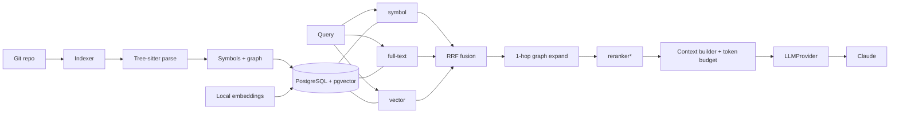

# CodeRAG

**Token-efficient, structure-aware Code Intelligence + RAG for private source repositories.**

CodeRAG indexes private source-code repositories, retrieves *only the code relevant* to a
developer's request, builds a **token-budgeted** context package, and sends it to your
organisation's Claude endpoint (or any LLM behind the `LLMProvider` interface).

> **Primary objective:** reduce LLM input-token consumption **without** reducing answer
> quality — and *prove it with measurements*, never claims.

This is **not** a generic document-RAG app:

- **Chunks are code constructs** — functions/methods/classes/modules — via Tree-sitter, never
  fixed-size text slices.
- **Retrieval is hybrid**: exact-symbol + PostgreSQL full-text (lexical) + pgvector (semantic)
  + a lightweight one-hop code graph, fused with Reciprocal Rank Fusion.
- **Every result explains *why*** it was retrieved (`exact_symbol`, `lexical`, `semantic`,
  `graph_caller`, `graph_test`, …).
- **Embeddings run locally** by default — no source code leaves your infrastructure.
- **Retrieval works with no LLM.** Only `ask` needs a provider.

## What problem this solves

Instead of pasting whole files (or a whole repo) into a prompt, CodeRAG retrieves the smallest
useful set of symbols for a task and packs them under a hard token budget, deduplicating
overlapping code and dropping low-priority symbols before anything is sent externally. Token
consumption is measured end-to-end and comparable against a naive baseline.

## Architecture



Full details: [`docs/architecture.md`](docs/architecture.md), plus ADRs in
[`docs/adr/`](docs/adr/) and topic docs for [retrieval](docs/retrieval.md),
[security](docs/security.md), [evaluation](docs/evaluation.md),
[LLM providers](docs/llm-providers.md), and [adding a language](docs/adding-language.md).

## Install

```bash
# from source (this repo)
pip install git+https://github.com/galacticsurfer/coderag
# with local semantic embeddings (pulls torch)
pip install "coderag[embeddings] @ git+https://github.com/galacticsurfer/coderag"
# or clone + editable
git clone https://github.com/galacticsurfer/coderag && cd coderag && pip install -e ".[dev]"
```

This installs the `coderag` CLI and the `coderag.api.app` FastAPI app. Extras: `embeddings`
(SentenceTransformers), `tokens` (tiktoken), `analyzers` (pylint/flake8), `metrics`
(prometheus). You still need a PostgreSQL+pgvector to point `CODERAG_DATABASE_URL` at
(`docker compose up -d` provides one).

## Quick start

### Option A — Docker one-shot (recommended)

One command boots PostgreSQL+pgvector **and** the API, runs migrations, and indexes the bundled
demo repo so the dashboard has data immediately:

```bash
make up          # == docker compose up -d --build
# open http://localhost:8000/dashboard   and   http://localhost:8000/docs
```

Index *your own* code (mount it, then run the indexer inside the container):

```bash
CODERAG_REPO_PATH=/abs/path/to/your/repo make up
docker compose exec api coderag index /workspace --name myrepo
docker compose exec api coderag search "where are failed payments retried?" --repo myrepo
```

### Option B — Local (venv)

```bash
cp .env.example .env
docker compose up -d db                         # just Postgres+pgvector
make install && make migrate
coderag index ./examples/demo-repository
coderag search  "where are failed payments retried?"                # no LLM needed
coderag context "why can payment retry leave an invoice pending?"   # no LLM needed
coderag eval                                                        # Recall@K, MRR, tokens
coderag benchmark --compare-baseline                                # measured token savings
coderag ask     "why can payment retry leave an invoice pending?"   # needs an LLM (see below)
```

### Do I need an API key?

**No — for almost everything.** `index`, `search`, `context`, `eval`, `benchmark`, and the
`/dashboard` are pure retrieval + local embeddings + telemetry: **no key, nothing leaves your
box.** Only **`ask`** calls an LLM to turn the retrieved context into a natural-language answer,
so only `ask` needs `CODERAG_ANTHROPIC_API_KEY` (or an internal proxy / Bedrock — see
[`docs/llm-providers.md`](docs/llm-providers.md)). That separation is the whole point: you can
run, measure, and demo the token savings with zero LLM credentials.

## Indexing

```bash
coderag index /path/to/repo --name myrepo     # full index
coderag index /path/to/repo --incremental     # only reindex what changed since last commit
```

Respects `.gitignore`; skips vendored/generated/binary files and secret files (`.env`,
`*.pem`, keys, …); redacts residual secret-shaped strings; never indexes credentials.
Incremental indexing preserves embeddings for unchanged code.

## Searching & context

```bash
coderag search "retry failed payment" --repo myrepo --limit 10
coderag context "why pending?" --show-prompt          # exact prompt + token accounting
```

`coderag context` prints the selected symbols by priority (target → dependencies → callers →
tests → semantic → additional), the token accounting, and (optionally) the full prompt — so
you can debug token usage without calling the model.

## Claude configuration

Set in `.env` (never commit credentials):

```
CODERAG_LLM_PROVIDER=anthropic
CODERAG_ANTHROPIC_API_KEY=sk-...
CODERAG_ANTHROPIC_BASE_URL=https://api.anthropic.com   # or your internal proxy
CODERAG_ANTHROPIC_MODEL=claude-sonnet-5
```

The provider talks to the Messages API over HTTP, so pointing it at an internal proxy — or
subclassing for AWS Bedrock — needs no changes to the retrieval layer
([`docs/llm-providers.md`](docs/llm-providers.md)).

## Embedding configuration

```
CODERAG_EMBEDDING_PROVIDER=hashing            # offline default (deterministic)
# or, for genuine semantics (installs torch): pip install 'coderag[embeddings]'
CODERAG_EMBEDDING_PROVIDER=sentence_transformer
CODERAG_EMBEDDING_MODEL=sentence-transformers/all-MiniLM-L6-v2
```

The default `hashing` embedder is offline and deterministic (great for CI/air-gapped dev);
similarity reflects shared vocabulary. Switch to the local SentenceTransformers model for true
semantic matching — code still never leaves your infra.

## Evaluation & token measurement

```bash
coderag eval --dataset examples/eval/eval_dataset.json
coderag benchmark --compare-baseline
```

On the bundled demo (offline `hashing` embedder), measured:

| metric | value |
|--------|-------|
| Recall@1 / @3 / @5 / @10 | 0.375 / 0.625 / 0.875 / **1.000** |
| MRR | 0.574 |
| search latency p50 / p95 | ~6 ms / ~9 ms |
| context reduction vs whole-repo baseline | ~13% |

**On token savings, honestly:** the demo repo is tiny (~1.9k tokens total), so whole-repo
reduction is modest. Savings scale with repository size — on a real codebase you send a few
thousand budgeted tokens instead of the whole repo. The point is that it's **measured**
(`coderag benchmark`), never asserted. Recall@1 is limited by the offline hashing embedder;
the local SentenceTransformers model improves ranking.

## Security model

Source code is treated as sensitive: secrets are never indexed, credentials are redacted, full
source/prompts are never logged, every retrieval query is scoped by `repository_id` (cross-repo
isolation is a test, not a hope), and an `AuthorizationProvider` interface gates repository
access. Retrieved code is delimited as untrusted **data** in the prompt to mitigate injection.
See [`SECURITY.md`](SECURITY.md) and [`docs/security.md`](docs/security.md).

## Limitations (MVP)

- **Python only** (architecture is language-independent; other parsers are interface stubs).
- **Graph is syntax-heuristic**: only in-repo, confidently-resolved edges are stored
  (incomplete-but-correct by design). Ambiguous/external calls are dropped.
- **Exact vector scan** (no HNSW yet — added when dataset size warrants).
- **Token counts are estimates** for budgeting; authoritative counts come from the LLM's usage
  report (stored in `llm_requests`).
- Default `hashing` embedder is lexical-overlap, not truly semantic.
- Analyzer workflow produces **fix context + proposals**; patch apply/verify is a caller
  interface (bounded by `MAX_FIX_ATTEMPTS`).
- The MVP `AuthorizationProvider` is permissive (development). Deploy a real one.

## API

`uvicorn coderag.api.app:app` exposes `POST /repositories`, `/repositories/{id}/index`,
`GET /repositories/{id}/index/status`, `POST /search`, `POST /context`, `POST /ask`,
`GET /symbols/{id}`, `/symbols/{id}/relationships`, `GET /metrics`, `GET /queries`, and a
`GET /dashboard` page.

## Dashboard

A self-contained observability page at **`/dashboard`** (no external assets, light/dark) shows
*what was queried and how many tokens the budgeted context saved* — KPI tiles (tokens saved,
overall reduction, LLM tokens), a per-query "context vs. saved" bar chart, and a full query log.
It reads the persisted `queries`/`llm_requests` telemetry via `GET /metrics` and `GET /queries`.

```bash
uvicorn coderag.api.app:app --port 8000   # then open http://localhost:8000/dashboard
```

## Development

```bash
make lint typecheck test      # ruff + mypy + pytest
```

Tests use [`pgserver`](https://pypi.org/project/pgserver/) — a rootless, bundled
PostgreSQL+pgvector — so the DB/FTS/vector paths are exercised for real, no Docker required.

Licensed under **Apache-2.0** (see [`LICENSE`](LICENSE) / [`NOTICE`](NOTICE)). Dependency
licenses (incl. the psycopg LGPL and pylint GPL flags) are in
[`docs/licenses.md`](docs/licenses.md).

## Editor integration (VS Code)

A ready-to-build extension lives in [`vscode-extension/`](vscode-extension/) — commands for
**Index this workspace** (the indexing step, one click), **Search symbols**, **Show context**,
**Ask about this code** (right-click), and **Open token dashboard**.

```bash
cd vscode-extension && npm install && npm run package   # → coderag-vscode-0.1.0.vsix
code --install-extension coderag-vscode-0.1.0.vsix
```

Or download the prebuilt `.vsix` from the repo's
[Releases](https://github.com/galacticsurfer/coderag/releases). It's a thin client — point
`coderag.serverUrl` at your running CodeRAG server. Design notes:
[`docs/vscode-extension.md`](docs/vscode-extension.md).
