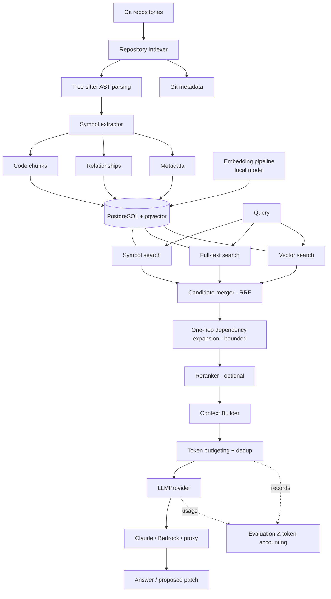

# Architecture

CodeRAG indexes private repositories into PostgreSQL, retrieves the smallest useful set of
code for a request via hybrid search + a lightweight code graph, packs it into a
token-budgeted context, and sends that to a provider-independent LLM.

## Components

| Layer | Package | Responsibility |
|-------|---------|----------------|
| Config/logging/tokens | `core/` | Settings (all tunables), structured logging (no payloads), token counting |
| DB | `db/` | SQLAlchemy models, engine/session, Alembic migrations, data-access repos |
| Git | `git/` | File enumeration, commit SHA, diffs (base..head) → changed line ranges |
| Parsing | `parsing/` | `LanguageParser` interface, `PythonParser` (Tree-sitter) |
| Indexing | `indexing/` | Full + incremental indexing, ignore/secret filtering |
| Embeddings | `embeddings/` | `EmbeddingProvider` (hashing/SentenceTransformers), cache by source_hash+model |
| Retrieval | `retrieval/` | symbol/lexical/semantic/graph retrievers, RRF fusion, optional reranker, engine |
| Context | `context/` | Priority-ordered, deduplicated, token-budgeted context package + prompt format |
| LLM | `llm/` | `LLMProvider`, `AnthropicClaudeProvider`, usage accounting |
| Evaluation | `evaluation/` | Recall@K, MRR, baseline-vs-RAG token comparison, benchmark |
| Analyzers | `analyzers/` | Pylint/Flake8 adapters + bounded fix workflow (Phase 10) |
| Security | `security/` | secret patterns/redaction, `AuthorizationProvider` |
| API/CLI | `api/`, `cli/` | FastAPI endpoints + Typer CLI |

## Key decisions

See the ADRs in [`adr/`](adr/): Postgres+pgvector (001), structural chunks (002), hybrid
search (003), Tree-sitter (004), provider independence (005), repository isolation (006),
token budgeting (007).

## Why sync

Indexing/embedding are CPU-bound; retrieval is a handful of fast queries. Async would add
complexity without throughput here, so the MVP is synchronous end-to-end (FastAPI runs sync
endpoints in a threadpool). Revisit only if a real bottleneck appears.
